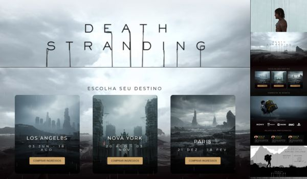
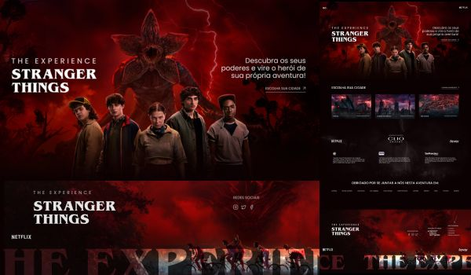
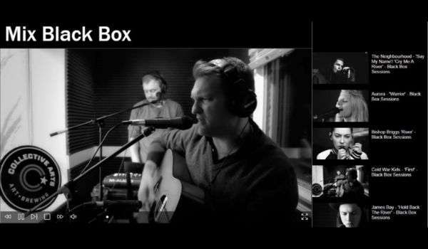
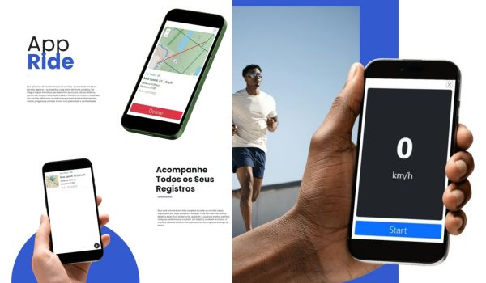
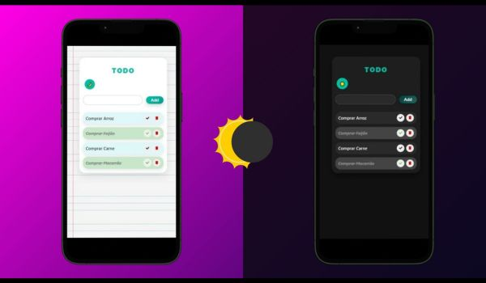
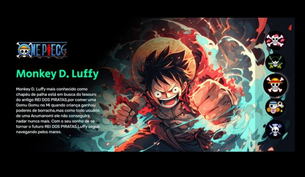

<!-- ===================== BANNER ===================== -->

  

### 💻 About Me
Sou desenvolvedor **Front-End + UI/UX Designer**, criando interfaces modernas, intuitivas e funcionais.  
Apaixonado por transformar ideias em experiências digitais incríveis.

---

## 🚀 Explore My Work

### 🌐 Últimos Projetos
Aqui estão alguns dos meus projetos recentes (🌐 Live Demo · 💻 Source Code):

|-----------|-----------|-----------|
|-----------|-----------|-----------|
|  |  |  |
| **Death Stranding** 🌐 · 💻 | **Stranger Things** 🌐 · 💻 | **Vídeo Page** 🌐 · 💻 |
| Página temática do jogo Death Stranding | Página inspirada na série Stranger Things | Página de vídeos em HTML |

|-----------|-----------|-----------|
|-----------|-----------|-----------|
|  |  |  |
| **Rider App** 🌐 · 💻 | **Todo App** 🌐 · 💻 | **One Piece GG** 🌐 · 💻 |
| App de gerenciamento de corridas | Lista de tarefas simples com funcionalidades básicas | Página temática de anime em HTML |

---

## 🛠 Tech Stack

  
  
  
  
  
  

---

## 📊 GitHub Stats

  

---

## 📫 Connect With Me

  
  
  

